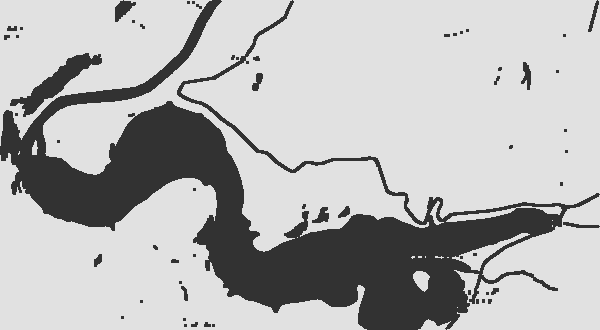

# Forest Fire Simulation
## Introduction
College project on discrete modeling using cellular automata and various image tranformations. 

## Step by step
* Adding the source image to the project.

    

* The terrain image from google maps is binarized to separate the non-flammable terrain from the rest by the specified key.

    

* For a more logical and realistic simulation, the image is dilated - removal of small, isolated objects, as well as smoothing out the contours of a binary image.

    

* Simulating a forest fire using cellular automata in a regular window application to create and refine probability coefficients.

    

* Adding the wind functionality - creating and refining wind-effect matrices.

    

* Joining all the steps together.

### The final result

## Sources and inspirations
* https://en.wikipedia.org/wiki/Cellular_automaton
* https://nhess.copernicus.org/preprints/nhess-2018-227/nhess-2018-227.pdf
* https://youtu.be/bUd4d8BDIzI
